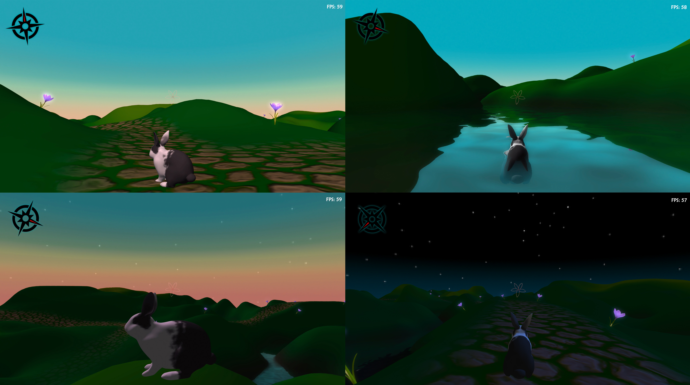

### Work in progress 3D game - C++ and OpenGL

---
**Roam the world as a rabbit**


---
# Requirements
- Meson to build
- clang
- OpenGL v3.3

### Meson
**Meson to build before compiling**

Helpful links
- https://mesonbuild.com/Getting-meson.html
- https://mesonbuild.com/Quick-guide.html

**Ubuntu**
```
$ sudo apt-get install python3 python3-pip python3-setuptools \
                       python3-wheel ninja-build
```

**Installation using Python**
```
$ pip3 install meson
$ pip3 install ninja
```

---
### Required dependencies
- GLFW
- GLEW
- GLM

**Homebrew**
```
$ brew install glfw3
$ brew install glew
$ brew install glm
```
---
## Build
##### Create build directory - specify clang as compiler
**In project root directory**
```
$ CC=clang CXX=clang++ meson build
$ cd build
```

## Compile
**In build directory**

```
$ ninja
```
or
```
$ meson compile
```

## Run
**In build directory**
```
$ cd src
$ ./game
```


